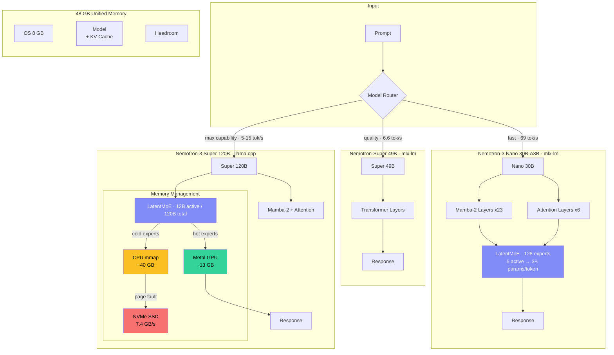

# Nemotron-3 on Apple Silicon via MLX

Efficient inference of NVIDIA's Nemotron-3 model family on Apple Silicon (M4 Pro, 48GB) using MLX + LLM-in-a-Flash techniques.

## Verified Benchmarks (M4 Pro 48GB)

| Model | Avg tok/s | Peak tok/s | Memory | Load Time |
|-------|-----------|-----------|--------|-----------|
| **Nano 30B-A3B 4-bit** | **69.0** | **88.6** | 16.6 GB | 5.8s |
| **Super 49B 4-bit** | **6.6** | **7.6** | 26.2 GB | 9.8s |
| Super 120B-A12B Q4 | est. 3-8 | — | ~56 GB (9.5 active) | experimental |

## Quick Start

```bash
python3.11 -m venv .venv && source .venv/bin/activate
pip install -r requirements.txt

# Nemotron-3 Nano (recommended — fastest, fits easily)
python run.py --model nano-4bit --prompt "Your question here"

# Nemotron-Super 49B (higher quality, fits at 4-bit)
python run.py --model super-49b --prompt "Your question here"

# Benchmark mode
python run.py --model nano-4bit --benchmark --output-json results/bench.json

# Compare all benchmarks
python compare.py

# 120B Flash analysis (check if mmap offloading is feasible)
python flash_loader.py --analyze-only
```

## Models

| Key | Model | Total | Active | Arch | Quant | HuggingFace |
|-----|-------|-------|--------|------|-------|-------------|
| `nano` | Nano 30B-A3B | 30B | 3B | Mamba-2 + MoE + Attn | 8-bit | lmstudio-community/...MLX-8bit |
| `nano-4bit` | Nano 30B-A3B | 30B | 3B | Mamba-2 + MoE + Attn | 4-bit | mlx-community/...4bit |
| `super-49b` | Super 49B v1 | 49B | 49B | Llama-3.3 hybrid | 4-bit | mlx-community/...mlx-4bit |
| `super-120b` | Super 120B-A12B | 120B | 12B | Mamba-2 + MoE + Attn | Q4 GGUF | unsloth/...GGUF |

## Architecture



### Nemotron-3 Family (March 2026)

**Not Llama-based.** The Nemotron-3 architecture is a **hybrid Mamba-2 + Transformer + LatentMoE**:
- **Mamba-2 layers** handle majority of sequence processing (linear-time attention)
- **Transformer attention layers** at key depths for retrieval/long-range
- **LatentMoE** projects tokens into latent space for efficient expert routing
- **Multi-Token Prediction (MTP)** enables native speculative decoding
- Native **1M-token context window**

| Variant | Architecture Details |
|---------|-------------------|
| **Nano 30B-A3B** | 23 Mamba-2/MoE + 6 Attention layers, 128 experts + 1 shared, 5 active per token |
| **Super 120B-A12B** | Mamba-2 + Transformer + LatentMoE, 12B active of 120B total |
| **Llama-3.3-Nemotron-Super-49B** | Llama-3.3 backbone (standard Transformer), NAS-optimized layers |

Note: MLX Mamba-2 support is still maturing ([mlx-examples #1030](https://github.com/ml-explore/mlx-examples/issues/1030)).
The Nano and 49B variants work today; the 120B is experimental.

### LLM-in-a-Flash Techniques

From Apple's paper (Alizadeh et al., arXiv:2312.11514):

| Technique | Status | Impact |
|-----------|--------|--------|
| Flash loading (mmap) | **Built into MLX** | safetensors memory-mapped by default |
| Row-column bundling | Not needed | Models fit in RAM at Q4 (except 120B) |
| Sparsity-aware loading | **MoE-native** | Nemotron's LatentMoE only activates subset of experts |
| Adaptive memory mgmt | **OS-level** | macOS VM pages cold experts to NVMe (~7.4 GB/s) |
| Windowing | Model-dependent | Mamba-2's linear attention is inherently windowed |

### 120B Flash Feasibility (M4 Pro 48GB)

```
Total model (Q4):        55.9 GB   (exceeds 48GB RAM)
Active per token (12B):   5.6 GB   (fits easily)
Shared layers:            3.9 GB
Effective working set:    9.5 GB   ← this is what stays in RAM
Cold experts (on SSD):   46.4 GB   ← served via NVMe mmap

FEASIBLE: Working set fits with 11 GB headroom
```

The MoE architecture makes LLM-in-a-Flash viable: only 12B of 120B params
are active per token. macOS virtual memory pages cold experts to NVMe SSD,
acting as the "adaptive memory manager" Apple's paper describes.

### Memory Budget

```
Total unified memory:           48.0 GB
OS + system services:           -8.0 GB
MLX runtime + Python:           -1.5 GB
Available for model:            38.5 GB
```

## Research

Researched using [AutoResearchClaw](https://github.com/aiming-lab/AutoResearchClaw) (9-stage pipeline: topic init, problem decomposition, literature search, knowledge extraction, synthesis, hypothesis generation, experiment design).

Key research outputs in `research/`:
- `synthesis.md` — Full literature synthesis with gap analysis
- `hypotheses.md` — Testable hypotheses (negative quant tax, page-fault MoE, KV-cache bifurcation)
- `problem_tree.md` — Structured research decomposition
- `innovator_hypotheses.md` — Novel optimization proposals

## References

- [NVIDIA Nemotron-3 Super Technical Report](https://research.nvidia.com/labs/nemotron/files/NVIDIA-Nemotron-3-Super-Technical-Report.pdf)
- [Apple "LLM in a Flash" (arXiv:2312.11514)](https://arxiv.org/abs/2312.11514)
- [MLX-LM](https://github.com/ml-explore/mlx-lm)
- [Nemotron-3 Nano HF](https://huggingface.co/nvidia/NVIDIA-Nemotron-3-Nano-30B-A3B-BF16)
- [MLX Mamba-2 support tracking](https://github.com/ml-explore/mlx-examples/issues/1030)
